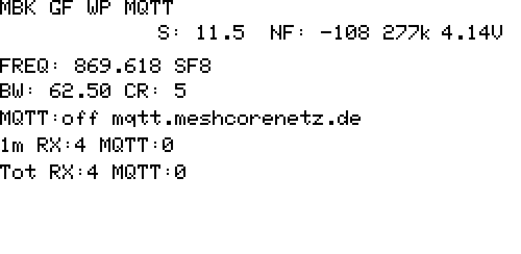
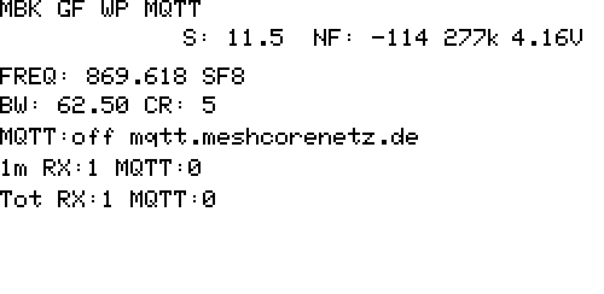
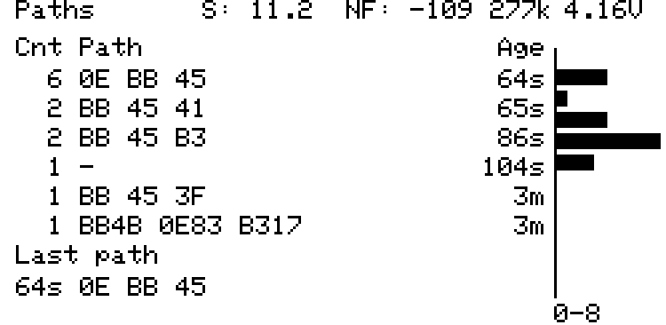
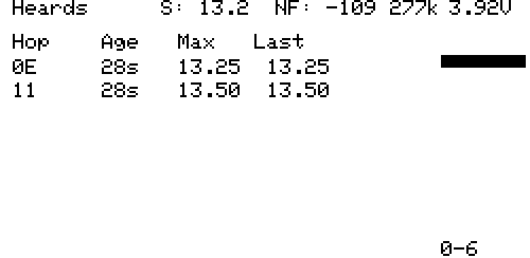
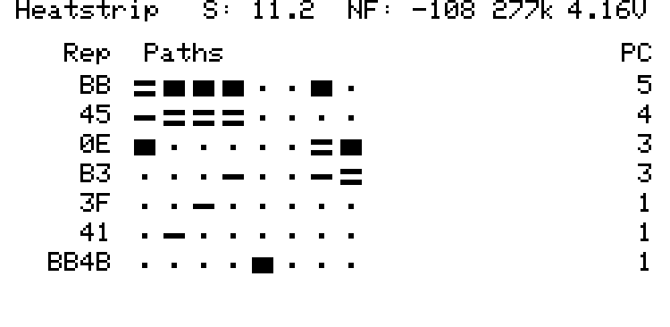
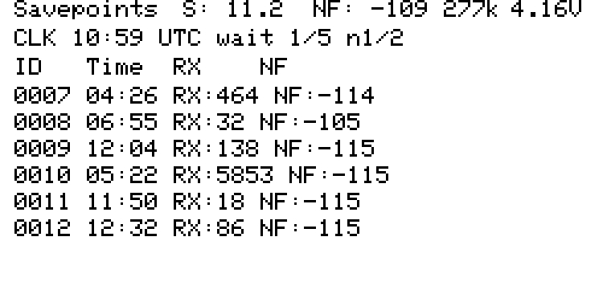
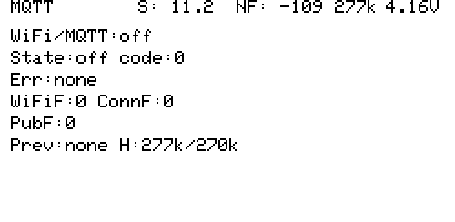

# MBK GF WP Field Monitor

Mobiler MeshCore-Feldmonitor fuer ein Heltec Wireless Paper. Das Geraet laeuft
als passiver Observer im Mesh, zeigt Empfangslage und Pfade direkt auf dem
E-Ink-Display und kann Messpunkte als Savepoints speichern.

Der Fokus liegt auf Feldtests im Bereich Braunschweig/Gifhorn: Standorte,
Antennen, Filter, Repeater-Pfade, Noise Floor, SNR und Netzlast lassen sich
ohne Laptop, WLAN oder MQTT direkt am Geraet beurteilen. WLAN/Web und MQTT sind
als optionale Nebenstrecken vorhanden, bleiben im aktuellen Build beim Boot aber
aus.



## Highlights

- Live-Observer fuer MeshCore RX-Aktivitaet, Pfade, letzte Hops und SNR
- E-Ink UI mit Status, Paths, Heards, Heatstrip, Load, Savepoints und MQTT
- Savepoints im SPIFFS-Flash fuer reproduzierbare Standort- und Antennentests
- Bedienung per Taste, serieller CLI oder MeshCore-Client
- Optionaler Field-Web-AP unter `http://192.168.4.1/`
- Optionaler MQTT-Publish von RX/TX-Paketen
- RTC-Breadcrumbs fuer Reset-/Watchdog-Diagnose auf ESP32-S3

## Schnellstart

Build:

```sh
pio run -e Heltec_Wireless_Paper_mqtt_observer
```

Flash, wenn das WP per USB angeschlossen ist:

```sh
pio run -e Heltec_Wireless_Paper_mqtt_observer -t upload --upload-port /dev/cu.usbserial-0001
```

Serieller Smoke-Test:

```sh
python tools/wp_smoke.py --port /dev/cu.usbserial-0001
```

Die absolute PlatformIO-Python-Umgebung des lokalen Entwicklungsrechners kann
ebenfalls genutzt werden:

```sh
/Users/dirkehlert/.platformio/penv/bin/pio run -e Heltec_Wireless_Paper_mqtt_observer
```

## MeshCore-Client CLI

Das WP nimmt Admin-CLI-Kommandos auch ueber den MeshCore-Client entgegen. Das
ist im Feld oft der angenehmste Weg, weil kein USB-Kabel noetig ist.

```text
wp.help
diag
ap.on
ap.status
ap.off
view.on
view.status
view.off
mqtt.on
mqtt.status
mqtt.off
sp.create
sp.list
sp.show <id> [page]
sp.delete <id>
sp.clear
discover.neighbors
```

Langformen wie `web.ap on`, `web.view status` und `mqtt status` bleiben
weiterhin gueltig. `screen.dump` ist bewusst nur seriell sinnvoll, weil es
Bilddaten ausgibt.

## Hardware

- Board: Heltec Wireless Paper
- MCU: ESP32-S3
- Display: E-Ink, `E213Display`
- Upload-Port: `/dev/cu.usbserial-0001`
- Upload-Speed: `115200`

## PlatformIO Environment

Build- und Upload-Environment, wenn die lokale PlatformIO-Umgebung direkt
verwendet werden soll:

```sh
/Users/dirkehlert/.platformio/penv/bin/pio run -e Heltec_Wireless_Paper_mqtt_observer
/Users/dirkehlert/.platformio/penv/bin/pio run -e Heltec_Wireless_Paper_mqtt_observer -t upload --upload-port /dev/cu.usbserial-0001
```

Die Konfiguration liegt in:

```text
variants/heltec_wireless_paper/platformio.ini
```

## Mesh-Konfiguration

- Node Name: `MBK GF WP MQTT`
- Position: `52.4770, 10.5419`
- Standort: Deutschland, Gifhorn, Braunschweiger Strasse / Ecke Loenseck
- Default Region/Scope: `bsmesh`
- Node-Typ im Advert: Repeater
- Forwarding: deaktiviert fuer Observer-Betrieb
- Lokale Adverts: aktiv
- Flood-Adverts: manuell per CLI oder Taste moeglich

Wichtige CLI-Kommandos:

```text
set lat 52.4770
set lon 10.5419
region default bsmesh
advert.zerohop
advert
```

## WLAN

- SSID: lokal im Build als `MQTT_OBSERVER_WIFI_SSID` hinterlegt
- Passwort: lokal im Build als `MQTT_OBSERVER_WIFI_PASSWORD` hinterlegt

## Field-Web-AP

Der WP kann fuer Feldarbeit einen lokalen Access Point oder eine
WLAN-Station-View starten. Im aktuellen Build bleiben AP, WLAN-Station-View und
MQTT beim Boot bewusst aus. Das lokale Display ist damit die priorisierte
Live-Ansicht; Web View oder MQTT werden nur explizit per CLI bzw. Taste
aktiviert.

Fuer einen spaeteren Feld-/MQTT-Build kann wieder bewusst entschieden werden,
ob `OBSERVER_WEB_AP_DEFAULT_ON` oder `OBSERVER_WEB_VIEW_DEFAULT_ON` aktiv sein
soll.

CLI-Kommandos:

```text
ap.on
ap.status
ap.off
view.on
view.status
view.off
mqtt.on
mqtt.status
mqtt.off
```

Die aelteren Langformen `web.ap on|off|status`, `web.view on|off|status` und
`mqtt on|off|status` bleiben als Aliases verfuegbar.

Alternativ kann der Field-Web-AP direkt am Geraet auf dem MQTT-Screen per
Doppelklick ein- und ausgeschaltet werden.

Beim Start des AP wird MQTT beendet, weil der ESP32-WiFi-Mode auf Access Point
wechselt. Beim Stop des AP wird MQTT wieder gestartet, sofern MQTT in den Prefs
aktiviert ist.

Der WLAN-Station-Viewmodus wird auf dem MQTT-Screen per Long Press aktiviert
oder per `view.on` gestartet. Dabei verbindet sich der Node mit dem
konfigurierten WLAN und stellt dieselbe Webseite im lokalen Netz bereit. MQTT
wird dabei persistent deaktiviert und bleibt aus, bis es explizit per `mqtt.on`
oder `set mqtt.enabled on` wieder aktiviert wird.

Wenn die WLAN-Verbindung im Viewmodus verloren geht, versucht der Node sie in
Abstaenden neu aufzubauen. Bleibt das WLAN laenger nicht erreichbar, startet er
den Field-Web-AP, damit das Geraet im Feld wieder direkt erreichbar bleibt.

Im Station-Viewmodus ist die Web-API read-only: Zeit- und Positionsaenderungen
werden abgelehnt. `POST /api/savepoint` bleibt erlaubt, damit waehrend eines
stationaeren Tests direkt ein Savepoint erzeugt werden kann.

- SSID: `MBK-GF-WP`
- Passwort: `observer2026`
- URL: `http://192.168.4.1/`

Die Webseite bietet:

- aktuelle Node-Zeit vom verbundenen Client setzen
- aktuelle Position des Clients speichern
- Load-Screen als automatisch aktualisiertes 12-Minuten-Balkendiagramm anzeigen
- Heatstrip-Screen als automatisch aktualisierte Pfad/Repr-Matrix anzeigen
- Savepoints listen
- neuen Savepoint erzeugen
- Savepoint-Liste als CSV exportieren
- einzelne Savepoints als CSV herunterladen

Web-API:

```text
GET  /api/status
GET  /api/monitor
POST /api/time?epoch=<unix_utc>
POST /api/position?lat=<lat>&lon=<lon>
POST /api/savepoint
GET  /sp.list.csv
GET  /sp.csv?id=<id>
```

`/api/status` liefert Node-Name, UTC-Zeit, Position, SNR, Noise Floor, freien
Heap, Batterie und Savepoint-Metadaten. `/api/monitor` liefert RX-Minutenwerte,
Load-Airtime und Heatstrip-Daten fuer die Live-Ansicht.

Hinweis: Browser-Geolocation kann auf iOS ueber unverschluesseltes
`http://192.168.4.1` blockiert werden. Die Webseite bietet deshalb auch
manuelle Lat/Lon-Felder. Fuer automatisches Setzen per iPhone ist ein iOS
Shortcut sinnvoll, der den aktuellen Standort abfragt und `/api/position` mit
`lat` und `lon` aufruft.

iOS Shortcut fuer Position:

1. Aktion `Aktuellen Standort abrufen`
2. Aktion `Inhalt von URL abrufen`
3. URL:

```text
http://192.168.4.1/api/position?lat=<Breitengrad>&lon=<Laengengrad>
```

4. Methode: `POST`

Die Weboberflaeche und die manuellen Lat/Lon-Felder bleiben parallel nutzbar.

## MQTT

- Broker: `mqtt.meshcorenetz.de`
- Port: `1883`
- TLS: nein
- Username: `observer`
- Passwort: im Build als `MQTT_OBSERVER_PASSWORD` hinterlegt
- Topic:

```text
meshcore/BWE/{PUBLIC_KEY}/packets
```

Der Platzhalter `{PUBLIC_KEY}` wird zur Laufzeit durch den Public Key des
Geraets ersetzt.

Aktueller Public Key des Geraets:

```text
A4F610572F1F4C77CC27483B9920C347B7070B9471C8B24C413324BED5146EA8
```

Effektives Topic:

```text
meshcore/BWE/A4F610572F1F4C77CC27483B9920C347B7070B9471C8B24C413324BED5146EA8/packets
```

## MQTT Payload

Die Firmware publiziert derzeit kompakte JSON-Nachrichten:

```json
{
  "type": "rx",
  "pubkey": "...",
  "packet": "...",
  "payload_type": 1,
  "route": 1,
  "path_hash_size": 1,
  "path_hash_count": 2,
  "rssi": -80,
  "snr": 28
}
```

`type` ist `rx` fuer empfangene Pakete und `tx` fuer gesendete Pakete.

Hinweis: Der MQTT-Broker-Eingang wurde erfolgreich getestet. Fuer die
meshcorenetz.de Live-Ansicht kann ggf. noch eine Anpassung an deren
erwartetes Payload-Format sinnvoll sein.

## Display

Screen-Galerie:

| Status | Paths | Heards |
| --- | --- | --- |
|  |  |  |

| Heatstrip | Savepoints | MQTT |
| --- | --- | --- |
|  |  |  |

Status-Screen:

- Node-Name in eigener Kopfzeile
- zweite Kopfzeile mit SNR des letzten empfangenen Pakets, Noise Floor, freiem Heap und Batteriespannung
- Frequenz, SF, Bandbreite und Coding Rate
- MQTT-Status und Broker
- RX/MQTT Pakete der laufenden Minute
- Gesamtsummen seit Start

E-Ink-Ghosting wird durch periodische Full-Refreshes begrenzt: der
E213-Treiber nutzt fuer normale Aenderungen schnelle Partial-Updates, erzwingt
aber nach mehreren geaenderten Frames bzw. nach laengerer Laufzeit einen
vollen Panel-Refresh.

Pfad-Screen:

- haeufigste Pfad-Triples seit Start
- `cnt` zaehlt Treffer fuer das sichtbare Triple
- `age` zeigt, wann dieses Triple zuletzt gehoert wurde
- Anzeige zeigt aus Platzgruenden maximal die letzten 3 Hops
- Pfad-Hashes sind umgekehrt dargestellt, damit der naehere/lokale Teil links steht
- Pfadhistorie speichert bis zu 24 unterschiedliche Triple-Eintraege
- Rechts ein Aktivitaetsbalken fuer RX-Pakete der letzten 12 Minuten mit einem Balken pro Minute

MQTT-Screen:

- WLAN/MQTT ein/aus
- MQTT-Verbindungsstatus und letzter MQTT-State-Code
- letzter lokaler MQTT-Fehler
- Zaehler fuer WLAN-, MQTT-Verbindungs- und Publish-Fehler
- Field-Web-AP-Status mit Clientanzahl und IP-Adresse

Heards-Screen:

- letzter/naechster Hop der empfangenen Pakete
- Last Heard als Alter in Sekunden
- maximale SNR seit Start fuer diesen Hop
- letzte SNR fuer diesen Hop
- `PC` zeigt, in wie vielen aktuellen Pfad-Triples dieser Repeater vorkommt
- rechts derselbe RX-Aktivitaetsbalken wie auf dem Pfad-Screen

Heatstrip-Screen:

- grafische Repeater/Pfad-Matrix
- Spalten sind die Top-Pfad-Triples, Zeilen sind Repeater
- markierte Zellen bedeuten, dass der Repeater am jeweiligen Triple beteiligt ist
- Graustufen kodieren die Position im Triple: dunkel = letzter/naechster Rep, mittel = vorletzter Rep, hell = vorvorletzter Rep
- Punkt bedeutet, dass der Repeater in diesem Triple nicht enthalten ist
- `PC` rechts zeigt, in wie vielen Pfad-Triples dieser Repeater vorkommt
- Snapshot wird beim Betreten aufgebaut und danach nur per Doppelklick auf diesem Screen aktualisiert

Load-Screen:

- prozentuale RX-Netzauslastung auf Basis der geschaetzten Airtime
- 12-Minuten-Verlauf als Balken von links nach rechts
- rechte Legende mit letzter abgeschlossener Minute, Maximum und 12-Minuten-Durchschnitt
- wird im Normalbetrieb minutenweise aktualisiert, damit das E-Ink-Display nicht bei jedem RX neu gezeichnet wird

Savepoints-Screen:

- zweite Zeile zeigt die aktuelle UTC-Zeit und ob die Uhr gesetzt ist
- listet gespeicherte Savepoints mit ID, Uhrzeit, RX-Zaehler und Noise Floor
- Doppelklick erzeugt einen neuen Savepoint im Flash
- Long Press setzt Live-Zaehler, Pfade und Heards zurueck
- RX-Histogramm und Load-Airtime laufen beim Reset weiter und werden beim Savepoint mitgespeichert

Display-Snapshot aktualisieren:

```sh
tools/capture_screen.py --port /dev/cu.usbserial-0001 --output docs/screen-current.png
tools/capture_screen.py --port /dev/cu.usbserial-0001 --all
```

## Uhrzeit

Der Node synchronisiert seine Uhr nicht mehr aus dem Mesh. Die Uhr wird bewusst
lokal gesetzt:

- per Field-Web-AP ueber die Webseite
- per iOS Shortcut gegen `/api/time`
- per serieller CLI

Savepoints speichern die aktuelle UTC-Zeit, sofern sie zuvor gesetzt wurde.

## Diagnose

`diag` ist der wichtigste schnelle Gesundheitscheck. Der Befehl funktioniert
seriell und ueber den MeshCore-Client:

```text
Boot:PowerOn B:1 H:277k/270k IRQ:4/1544ms Up:16s RX:4 MQTT:0
Prev:none H:277k/270k
```

Die Felder:

- `Boot`: aktueller Reset-Grund, z. B. `PowerOn`, `Sleep`, `IntWDT`
- `B`: Boot-Counter aus dem RTC-Breadcrumb
- `H`: freier/minimaler Heap in KiB
- `IRQ`: gezaehlte Radio-IRQs und Alter des letzten IRQs
- `Up`: Uptime seit Boot
- `RX`/`MQTT`: lokale Observer-Zaehler
- `Prev`: letzter persistierter Screen/Phase/Marker vor dem Reset

Bei Watchdog-Resets helfen die Marker in `Prev`, um den letzten aktiven
Subsystembereich einzugrenzen:

```text
1 radio recv, 2 decode, 3 forward, 4 send, 5 display, 6 CLI, 7 flood advert
```

## Lokale Secrets

WLAN- und MQTT-Passwoerter werden nicht versioniert. Fuer lokale Builds:

```text
cp platformio.local.example.ini platformio.local.ini
```

Danach die Werte in `platformio.local.ini` anpassen. Diese Datei ist in
`.gitignore` eingetragen.

## Tastenbedienung

- Kurzer Klick: Status-Screen, Pfad-Screen, Heards-Screen, Heatstrip-Screen, Load-Screen, Savepoints-Screen und MQTT-Screen durchschalten
- Doppelklick auf Pfad- oder Heards-Screen: direkt zwischen diesen beiden Screens wechseln
- Doppelklick auf Heatstrip-Screen: Heatstrip-Snapshot aktualisieren
- Doppelklick auf Savepoints-Screen: Savepoint speichern
- Doppelklick auf MQTT-Screen: Field-Web-AP toggeln
- Doppelklick auf anderen Screens: Zero-Hop Advert senden
- Langer Druck auf Status-Screen: Flood-Advert senden
- Langer Druck auf Pfad-Screen: Hibernate
- Langer Druck auf Heards-Screen: Repeater-Discovery / Find Nearby Nodes senden
- Langer Druck auf MQTT-Screen: WLAN-Station-Viewmodus toggeln, MQTT bleibt aus
- Langer Druck auf Savepoints-Screen: Live-Zaehler zuruecksetzen

## ThinkNode M1 Companion

Zusaetzlich zum WP wird ein ThinkNode M1 als BLE-Companion-Radio gepflegt. Er
basiert auf dem Companion-Radio-Build, nicht auf dem Simple-Repeater-Build.

Build- und Upload-Environment:

```sh
/Users/dirkehlert/.platformio/penv/bin/pio run -e ThinkNode_M1_companion_radio_ble
/Users/dirkehlert/.platformio/penv/bin/pio run -e ThinkNode_M1_companion_radio_ble -t upload --upload-port /dev/cu.usbmodem11301
```

Tasten:

- Button 1: naechste Seite
- Button 2: vorige Seite
- Long Press auf dem Send-Screen: Auswahl bestaetigen bzw. senden
- Button 2 im Send-Dialog: Auswahl abbrechen
- Long Press auf einer angezeigten Nachricht: Reply-Auswahl oeffnen bzw.
  ausgewaehlte Antwort senden
- Button 1 in der Reply-Auswahl: vordefinierte Antwort weiterschalten
- Button 2 auf einer Nachricht: Nachricht pinnen oder entpinnen

Screens:

- Radio/Status mit Frequenz, BW, TX, Noise Floor, RX, SNR und Last Path
- OriginLane Messages
- Send-Screen fuer vordefinierte Nachrichten an Kanaele oder gehoerte Nodes
- Heatstrip statt alter Path-Seite
- Heard Repeaters
- Load-Screen statt Histogramm

Send-Screen:

- Ziele sind konfigurierte Kanaele und zuletzt gehoerte Kontakte; die lokale
  Auswahlliste fasst 48 Ziele, damit auch Channel-Slots hinter den ersten acht
  Eintraegen sichtbar bleiben
- Kanalnachrichten werden als lokale Echo-Nachricht in die App-Queue gelegt,
  damit sie in der verbundenen App sichtbar werden
- Direkte Node-Nachrichten werden gesendet, aber nicht als lokales Echo
  gefaelscht
- Die letzte dynamische Nachricht sendet die aktuelle GPS-Position als
  `Meine Position ist: <lat>, <lon>`, sofern ein gueltiger Fix vorliegt

Message-Reply:

- Eingehende direkte Nachrichten koennen direkt an den Absender beantwortet
  werden
- Kanalnachrichten werden auf demselben Kanal beantwortet und erwaehnen den
  erkannten Absender mit `@Name`, sofern der Ursprung im Text erkennbar ist
- Die Message-Ansicht zeigt den Receive-Pfad als `direct` oder Hopcount an
- Nach erfolgreichem Reply wird die urspruengliche Nachricht vom Geraet
  entfernt, ausser sie ist gepinnt
- Gepinnte Nachrichten bleiben sichtbar und koennen per Button 2 wieder
  entpinnt werden
- Zusaetzlich zu den gespeicherten Quick Messages gibt es dynamische Replies
  fuer GPS-Position und `predef sent from M1 Node : received you. hopcount: ...`

Quick-Message-CLI:

```text
qm.list
qm.set <1-9> <text>
qm.clear <1-9>
qm.reset
```

Die normalen seriellen CLI-Kommandos sind auch im laufenden BLE-Betrieb
verfuegbar.

## Savepoints

Savepoints werden als CSV-Dateien im SPIFFS-Flash abgelegt. Maximal 10
Savepoints werden gehalten; beim 11. Savepoint wird der aelteste geloescht.

CLI-Kommandos:

```text
sp.create
sp.list
sp.show <id> [page]
sp.delete <id>
sp.clear
```

`sp.create` erzeugt denselben Snapshot wie die Taste oder die Web-API:
Metadaten, Funkparameter, Batterie, Pfade, Heards, RX-Historie und Airtime.

`sp.show <id>` gibt eine kompakte Zusammenfassung mit RX/MQTT, NF, SNR,
Batterie sowie erstem Pfad und erstem Heard-Eintrag aus. `sp.show <id> <page>`
gibt den Savepoint als rohe CSV-Seite aus. Die CSV-Ausgabe ist wegen der
CLI-Antwortlaenge paginiert; jede Seite enthaelt bis zu 4 CSV-Zeilen.

Savepoints enthalten zusaetzlich:

- `hist,<minute>,<rx_packets>`: RX-Pakete pro Minute, neueste Minute zuerst
- `airtime_ms,<minute>,<rx_airtime_ms>`: geschaetzte RX-Airtime pro Minute, neueste Minute zuerst

## MQTT Fehlerverhalten

MQTT ist eine reine Observer-Nebenstrecke. MQTT-Fehler duerfen keine MeshCore
Pakete, ACKs, Adverts oder sonstige Antworten ins Mesh ausloesen. Fehler werden
nur lokal gezaehlt und auf dem MQTT-Screen angezeigt.

Wenn kein WLAN verfuegbar ist, laeuft der MeshCore/LoRa-Empfang weiter. Pakete
werden lokal gezaehlt, Pfade und Aktivitaet werden weiterhin angezeigt, nur der
MQTT-Publish schlaegt lokal fehl und erhoeht die Fehlerzaehler.

## Verifikation

Host-Regressionstests fuer die Observer-Web/API-Logik:

```text
python3 tools/observer_host_tests.py
```

Lokale Build-Matrix fuer die wichtigsten Ziele:

```text
/Users/dirkehlert/.platformio/penv/bin/pio run -e Heltec_Wireless_Paper_mqtt_observer -e ThinkNode_M1_field_monitor -e LilyGo_T-Echo_repeater -e WioTrackerL1_repeater
```

Optionaler Hardware-Smoke-Test, wenn das WP per USB angeschlossen ist:

```text
/Users/dirkehlert/.platformio/penv/bin/python tools/wp_smoke.py --port /dev/cu.usbserial-0001
```

Die GitHub Action `PR Build Check` fuehrt die Hosttests aus und baut danach die
Build-Matrix. Damit sollen Upstream-/Merge-Aenderungen frueh auffallen, bevor
sie auf dem Geraet landen.

MQTT Subscribe-Test:

```text
Topic: meshcore/BWE/+/packets
Broker: mqtt.meshcorenetz.de:1883
```

Dabei wurden Nachrichten vom Geraet unter dem Public-Key-Topic empfangen.

Letzter bekannter erfolgreicher Upload:

```text
Environment: Heltec_Wireless_Paper_mqtt_observer
Status: SUCCESS
```

## TODO Security Hardening

- MQTT-Credentials fuer den Feldbetrieb rotieren und moeglichst pro Node eigene
  User verwenden.
- MQTT von Port 1883 auf TLS/8883 umstellen; Server-Zertifikat bzw. CA pruefen.
- MQTT-ACL serverseitig eng setzen: Publish nur auf das eigene Topic, keine
  Wildcards, kein Subscribe.
- `ENABLE_PRIVATE_KEY_IMPORT` und `ENABLE_PRIVATE_KEY_EXPORT` fuer
  Produktions-Builds deaktivieren.
- `ADMIN_PASSWORD` nicht auf dem Default `password` lassen; lokales starkes
  Passwort in `platformio.local.ini` oder unbenoetigte Admin-Funktionen im
  Observer-Build deaktivieren.
- Serial CLI haerten: gefaehrliche Befehle nur nach Unlock oder Button-Gate,
  keine Secret-Ausgabe, optional Read-only-Modus nach normalem Boot.
- Observer-Only-Regel hart absichern: MQTT/WLAN/Savepoint/UI-Fehler duerfen
  niemals Mesh-TX ausloesen; Mesh-TX nur ueber explizite Whitelist erlauben.
- OTA aus dem Observer-Build entfernen, falls nicht aktiv benoetigt.
- Savepoint-Dateien weiter begrenzen und robust validieren; optional CRC pro
  Savepoint speichern.
- Build-Secrets nur in der ignorierten `platformio.local.ini` halten und nie
  committen.
- Dependencies moeglichst pinnen und Firmware-Releases mit Build-Hash
  dokumentieren.
